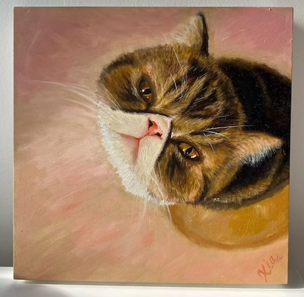
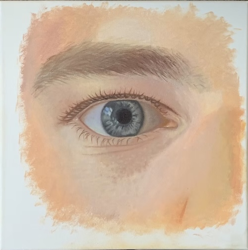
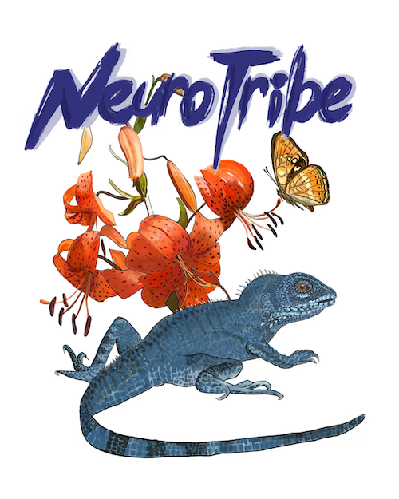
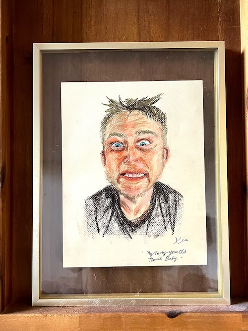
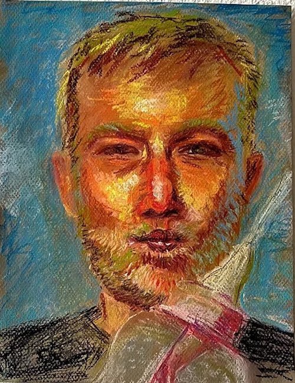

I'm a data science grad student at UCLA, where I spend most days making sense of messy [biomedical data](writings/biomedical-data) and [machine learning](writings/machine-learning). Lately, that’s meant working with [genomic datasets](writings/genomic-datasets), exploring [supervised and unsupervised learning](writings/supervised-unsupervised), and preparing for deep dives into [signal processing](writings/signal-processing) and [deep learning](writings/deep-learning). My work lives somewhere between clean code, clever ideas, and chaotic datasets — and I’m always up for a challenge that bridges technology, academia, and real-world impact.

This path didn’t happen overnight.

I grew up in a demolished neighborhood in Shanghai and moved to the U.S. alone at 17.

Since then, I've been drawn to systems — how they work, how they break, and how they shape lives. At UCLA, I studied Neuroscience and Computational & Systems Biology, building models of how neurons process information as my undergraduate capstone. Outside of school, I was building [Rono Dumplings](rono-dumplings.md) — a food business rooted in childhood memory, intuition, and operations data.

Starting a company taught me about logistics, storytelling, margins, and risk. It taught me what no algorithm could.

Now, I’m pursuing a Master’s in Data Science in Biomedicine. I’m focused on complex, high-stakes systems — medical, computational — and how we might make them more [accessible](/writings/accessible).

I care about serving clarity and enabling accessibility through technology — and working in ways that align with how life actually unfolds: messy, nonlinear, alive.

---

## Beyond Data Science

**Creative Work**: Painting provides creative balance to analytical work—I work in digital art, oil painting, and pastels. Recently started learning to sing. Art and music offer different approaches to problem-solving and help me think visually about complex systems.

**International Experience**: Born and raised in Shanghai until 17, then moved independently to California as an international student. Spent multiple summers (2018-2020) living in Germany, traveling throughout Europe (France, Netherlands, Belgium). Trilingual in Chinese, English, and German.

**Leadership & Service**: Co-founded Global Medical Brigades chapter at Pasadena City College, served as assistant Girl Scout leader supporting a leader with Multiple Sclerosis. Active in campus leadership from primary school in Shanghai through college.

**Cultural Bridge**: Navigate fluidly between Eastern, Western, and European approaches to problem-solving and communication—valuable for international business contexts and diverse team environments.

---

## Creative Portfolio

*Art provides creative balance to analytical thinking, offering different approaches to problem-solving and visual communication.*

### Featured Work

**Cat Portrait** *(2021, Oil on wood panel)*  
A birthday gift capturing my friend's deep affection for his cat. Demonstrates technical precision in oil painting and attention to emotional detail.

**An Eye** *(2022, Oil on canvas)*  
Realistic portrayal inspired by René Magritte's surrealism, exploring themes of observation and perception—concepts that resonate with data science work.

**Neurotribe** *(2020, Digital art - Procreate)*  
Created in response to the book 'NeuroTribes,' featuring a chameleon (representing masking in autism) and tiger lily (symbolizing resilience). Connects directly to my accessibility advocacy work.

### Additional Work

**Portrait of My Partner** *(2022, Pastel on paper)*  
40th birthday celebration piece capturing personality and character through warm pastel techniques.

**Second Portrait** *(2024, Pastel on paper)*  
More recent work exploring vibrant color and expressive mark-making to convey personality.

---

*Art and analytical work inform each other—both require careful observation, pattern recognition, and the ability to see systems from multiple perspectives.*

---

## For Recruiters & Teams

I thrive in environments where rigor and creativity coexist. My experimental nature means I’m constantly synthesizing across domains, asking different questions, and stress-testing assumptions — often leading to insights or frameworks others miss. I’m comfortable in ambiguity but decisive when it’s time to move. I don’t meander — I iterate.

You can explore my [CV]() and [Resume]().  
For selected work, check out [Projects]() or [Research]().

---

## Connect

- [GitHub](https://github.com/ronoxia)  
- [LinkedIn](https://www.linkedin.com/in/rono-x-99b181232/)

